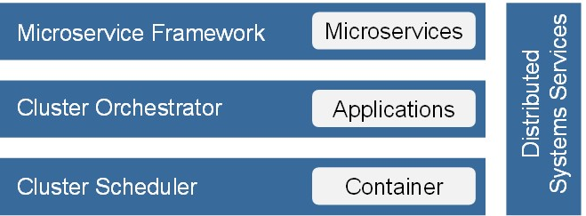

# Cloud Native Stack Technology Radar

Open Source Components for building a Cloud Native Stack.

## Cluster Scheduler
 * [Apache Mesos](http://mesos.apache.org)
 * [Docker Swarm](https://www.docker.com/products/docker-swarm)
 * [Hadoop YARN](http://hortonworks.com/hadoop/yarn)
 * [CoreOS fleet](https://github.com/coreos/fleet)
 * [Nomad](https://www.nomadproject.io)

## Microservice Framework
 * [Spring Cloud](http://projects.spring.io/spring-cloud)

## Cluster Orchestrator
 * [Kubernetes](http://kubernetes.io)
 * [Docker Compose](https://docs.docker.com/compose)
 * [Kontena](http://www.kontena.io)
 * [VAMP](http://vamp.io)
 * [Marathon](https://mesosphere.github.io/marathon) + [Chronos](http://mesos.github.io/chronos)
 * [Nulecule](http://www.projectatomic.io/docs/nulecule)
 * [Panamax](http://panamax.io)
 * [Apache Aurora](http://aurora.apache.org)
 * [Decking](http://decking.io)
 * [Rancher](https://github.com/rancher/rancher)
 * [Cloudify](http://getcloudify.org)
 * [Singularity](https://github.com/HubSpot/Singularity)
 * [OneOps](http://www.oneops.com)

## Distributed Systems Services

### Configuration & Coordination
 * ZooKeeper
 * etcd
 * Consul
 
### Service Discovery
 * Netflix Eureka
 * Consul
