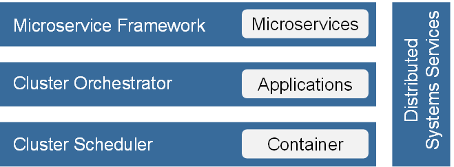

# Cloud Native Stack Technology Radar

Open Source Components for building a Cloud Native Stack.

## Cluster Scheduler
 * [Apache Mesos](http://mesos.apache.org)
 * [Docker Swarm](https://www.docker.com/products/docker-swarm)
 * [Hadoop YARN](http://hortonworks.com/hadoop/yarn)
 * [CoreOS fleet](https://github.com/coreos/fleet)
 * [Nomad](https://www.nomadproject.io)

## Cluster Orchestrator
 * [Kubernetes](http://kubernetes.io)
 * [Docker Compose](https://docs.docker.com/compose)
 * [Kontena](http://www.kontena.io)
 * [VAMP](http://vamp.io)
 * [Marathon](https://mesosphere.github.io/marathon) + [Chronos](http://mesos.github.io/chronos)
 * [Nulecule](http://www.projectatomic.io/docs/nulecule)
 * [Panamax](http://panamax.io)
 * [Apache Aurora](http://aurora.apache.org)
 * [Decking](http://decking.io)
 * [Rancher](https://github.com/rancher/rancher)
 * [Cloudify](http://getcloudify.org)
 * [Singularity](https://github.com/HubSpot/Singularity)
 * [OneOps](http://www.oneops.com)
 * [Apache Brooklyn](https://brooklyn.apache.org)

## Microservice Framework
 * [Spring Cloud](http://projects.spring.io/spring-cloud)
 * [Seneca](http://senecajs.org)

## Distributed Systems Services

### Configuration & Coordination
 * [ZooKeeper](https://zookeeper.apache.org) (Paxos)
 * [etcd](https://coreos.com/etcd/docs/latest) (Raft)
 * [Consul](https://www.consul.io) (Raft)
 * [doozerd](https://github.com/ha/doozerd) (Paxos)
 * [atomix](https://github.com/atomix/atomix) (Raft)
 * [Serf](https://www.serfdom.io) (Gossip)
 * [Netflix Archaius](https://github.com/Netflix/archaius)
 * [confd](http://www.confd.io)
 * [Spring Cloud Config](http://cloud.spring.io/spring-cloud-config)
 
### Service Discovery
 * [Netflix Eureka](https://github.com/Netflix/eureka)
 * [Consul](https://www.consul.io)
 * [SkyDNS](https://github.com/skynetservices/skydns)
 * [Hyperbahn](https://github.com/uber/hyperbahn)
 * [Skydock](https://github.com/crosbymichael/skydock)
 * [SmartStack](http://nerds.airbnb.com/smartstack-service-discovery-cloud)
 * [bamboo](https://github.com/QubitProducts/bamboo)
 * [WeaveDNS](http://docs.weave.works/weave/latest_release/weavedns.html)
 * [Marathon-LB](https://github.com/mesosphere/marathon-lb)

### Edge Server
 * [Netflix Zuul](https://github.com/Netflix/zuul)
 * [Traefik](http://traefik.github.io)
 * [VULCAN](http://vulcand.github.io)
 * [KONG](https://getkong.org)
 * [tyk](https://tyk.io)
 * [Weave Flux](https://github.com/weaveworks/flux)

### Monitoring & Logging
 * [Netflix Turbine](https://github.com/Netflix/Turbine)
 * [Netflix Atlas](https://github.com/Netflix/atlas)
 * [Spring Cloud Sleuth](http://cloud.spring.io/spring-cloud-sleuth)
 * [Zikin](https://github.com/openzipkin/zipkin)
 * [Prometheus](https://prometheus.io)
 * [Kibana](https://www.elastic.co/products/kibana)
 * [Grafana](http://grafana.org)
